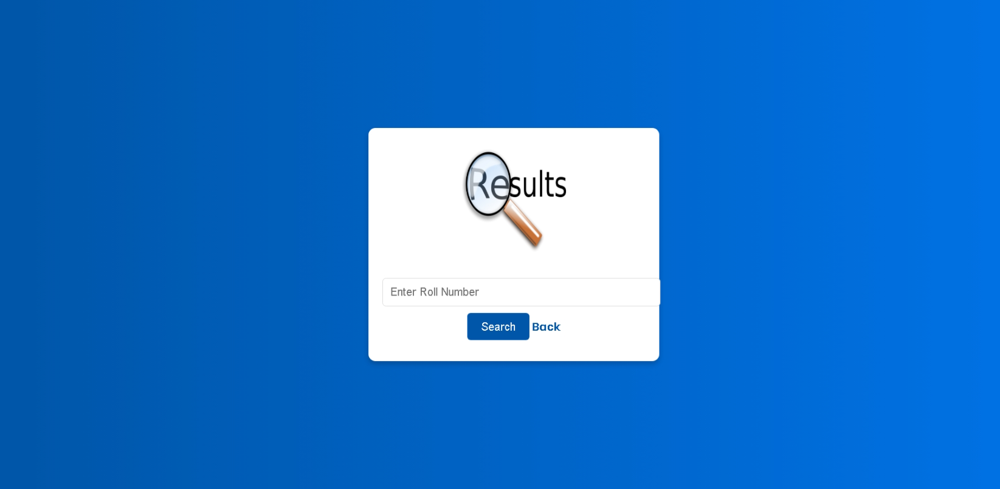

# Student Result Management System

The **Student Result Management System** is a web-based application designed to streamline the management and display of student results. It allows administrators to add and manage student data, while students can easily view their academic performance.

---

## Project Structure

```plaintext
StudentResultManagementSystem/
├── .classpath
├── .project
├── README.md
├── StudentResultManagementSystem.war
├── .settings/
│   ├── .jsdtscope
│   ├── org.eclipse.core.resources.prefs
│   ├── org.eclipse.jdt.core.prefs
│   ├── org.eclipse.wst.common.component
│   ├── org.eclipse.wst.common.project.facet.core.xml
│   ├── org.eclipse.wst.jsdt.ui.superType.container
│   └── org.eclipse.wst.jsdt.ui.superType.name
├── build/
│   └── classes/
│       └── com/
│           └── ashish/
│               └── ConnectionProvider.class
├── github_assets/
│   ├── add-new-student.png
│   ├── admin-dashboard.png
│   ├── admin-login.png
│   ├── all-student-results.png
│   ├── home.png
│   ├── insert-new-result.png
│   ├── registered-students.png
│   ├── result-page.png
│   └── student-login.png
├── src/
│   ├── main/
│   │   ├── java/
│   │   │   └── com/
│   │   │       └── ashish/
│   │   │           └── ConnectionProvider.java
│   │   └── webapp/
│   │       ├── assets/
│   │       │   ├── css/
│   │       │   │   ├── dgiOneView.css
│   │       │   │   ├── errorAdminLogin.css
│   │       │   │   ├── errorDgiOneView.css
│   │       │   │   ├── font-awesome.min.css
│   │       │   │   ├── login.css
│   │       │   │   ├── main.css
│   │       │   │   └── style.css
│   │       │   ├── fonts/
│   │       │   │   ├── fontawesome-webfont.eot
│   │       │   │   ├── fontawesome-webfont.svg
│   │       │   │   ├── fontawesome-webfont.ttf
│   │       │   │   ├── fontawesome-webfont.woff
│   │       │   │   ├── fontawesome-webfont.woff2
│   │       │   │   └── FontAwesome.otf
│   │       │   ├── images/
│   │       │   │   ├── apj_sir1.png
│   │       │   │   ├── atul.png
│   │       │   │   ├── atul1.png
│   │       │   │   ├── home.png
│   │       │   │   ├── logo.png
│   │       │   │   ├── print.png
│   │       │   │   ├── result.png
│   │       │   │   └── user.png
│   │       │   └── js/
│   │       │       ├── jquery.min.js
│   │       │       ├── main.js
│   │       │       ├── skel.min.js
│   │       │       └── util.js
│   │       ├── META-INF/
│   │       │   └── MANIFEST.MF
│   │       ├── pages/
│   │       │   ├── adminLogin.html
│   │       │   ├── dgiOneView.html
│   │       │   ├── errorAdminLogin.html
│   │       │   ├── errorDgiOneView.html
│   │       │   ├── header.html
│   │       │   └── index.html
│   │       ├── views/
│   │       │   ├── addNewStudent.jsp
│   │       │   ├── adminHome.jsp
│   │       │   ├── adminLoginAction.jsp
│   │       │   ├── insertNewResult.jsp
│   │       │   └── studentHome.jsp
│   │       └── WEB-INF/
│   │           ├── web.xml
│   │           └── lib/
│   │               └── mysql-connector-java-8.0.28.jar
│   │       db.sql
```

---

## Features

### For Administrators:
- **Secure Login**: Authenticate admin users.
- **Student Management**: Add, update, and manage student details.
- **Result Management**: Upload and edit student results.
- **Admin Dashboard**: View a summary of all student records.

### For Students:
- **Result Access**: Check academic results quickly.
- **Intuitive Interface**: A user-friendly platform for students to interact with.

---

## Prerequisites

Ensure the following software is installed:
- **Java Development Kit (JDK)** 8 or higher
- **MySQL Server** for the database
- **Apache Tomcat Server** for deployment
- **Eclipse IDE** (optional but recommended for development)

---

## Setup Instructions

### 1. Clone the repository:
```bash
git clone https://github.com/AshishBytes/StudentResultManagementSystem.git
```

### 2. Import the project into Eclipse:
- Go to `File > Import`.
- Select **Existing Projects into Workspace**.
- Browse and select the project directory.

Alternatively, you can import the `StudentResultManagementSystem.war` file directly into Eclipse for deployment or further development.


### 3. Configure the Database:
- Import the `db.sql` file into your MySQL server:
  ```bash
  mysql -u <username> -p < db.sql
  ```
- Update the database credentials in `ConnectionProvider.java`:
  ```java
  Connection con = DriverManager.getConnection("jdbc:mysql://localhost:3306/result", "root", "password");
  ```
  Replace `"root"` and `"password"` with your MySQL username and password.

### 4. Deploy the Application:
- Add the project to Apache Tomcat.
- Start the server and visit the application at:
  ```
  http://localhost:8080/StudentResultManagementSystem
  ```

---

## Tech Stack

- **Backend**: Java (JSP, Servlets)
- **Frontend**: HTML, CSS, JavaScript
- **Database**: MySQL
- **Server**: Apache Tomcat 9.0
- **Dependencies**: MySQL Connector for Java (v8.0.28)

---

## Dependencies

Ensure the following dependency is included:
- [MySQL Connector for Java](https://dev.mysql.com/downloads/connector/j/) (Version: 8.0.28)

Add it to the `lib` folder under `WEB-INF`.

---

## Screenshots

- **Home**
  

- **Admin Login**
  
  > **Note**: Use the following credentials for admin login:
  > - **Username**: `admin`
  > - **Password**: `admin`

- **Admin Dashboard**
  

- **Add New Student** (Part of Admin)
  

- **Insert New Result** (Part of Admin)
  

- **Registered Students** (Part of Admin)
  

- **All Student Results** (Part of Admin)
  

- **Student Login**
  

- **Result Page** (Part of Student)
  

---

## Author

**Ashish Singh**  
- **GitHub**: [AshishBytes](https://github.com/AshishBytes)  
- **Email**: _ashishlodhi5559@gmail.com_

---

Feel free to contribute to this project or provide feedback!
